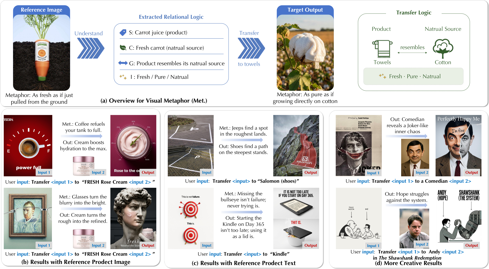
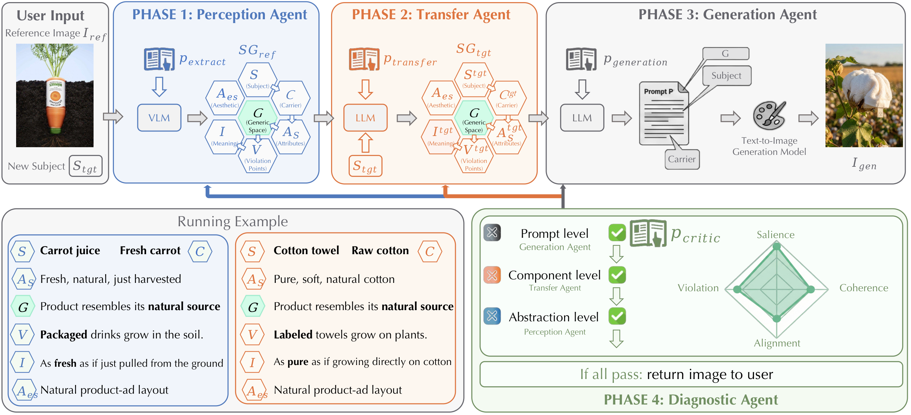
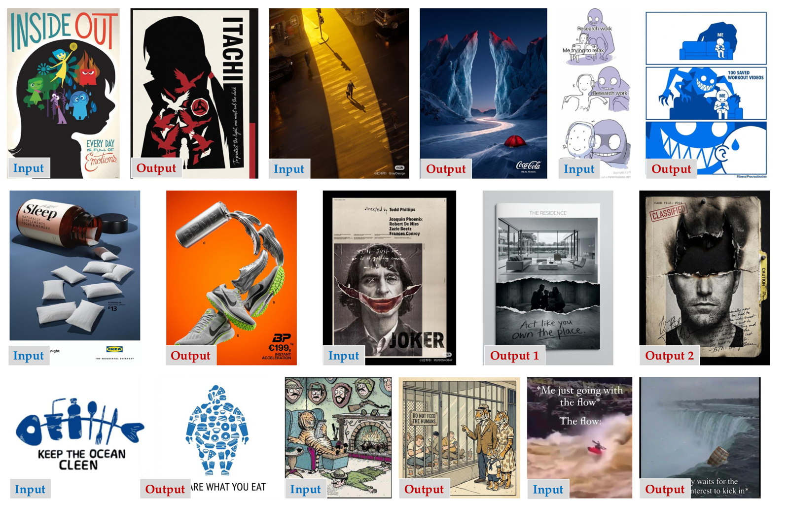
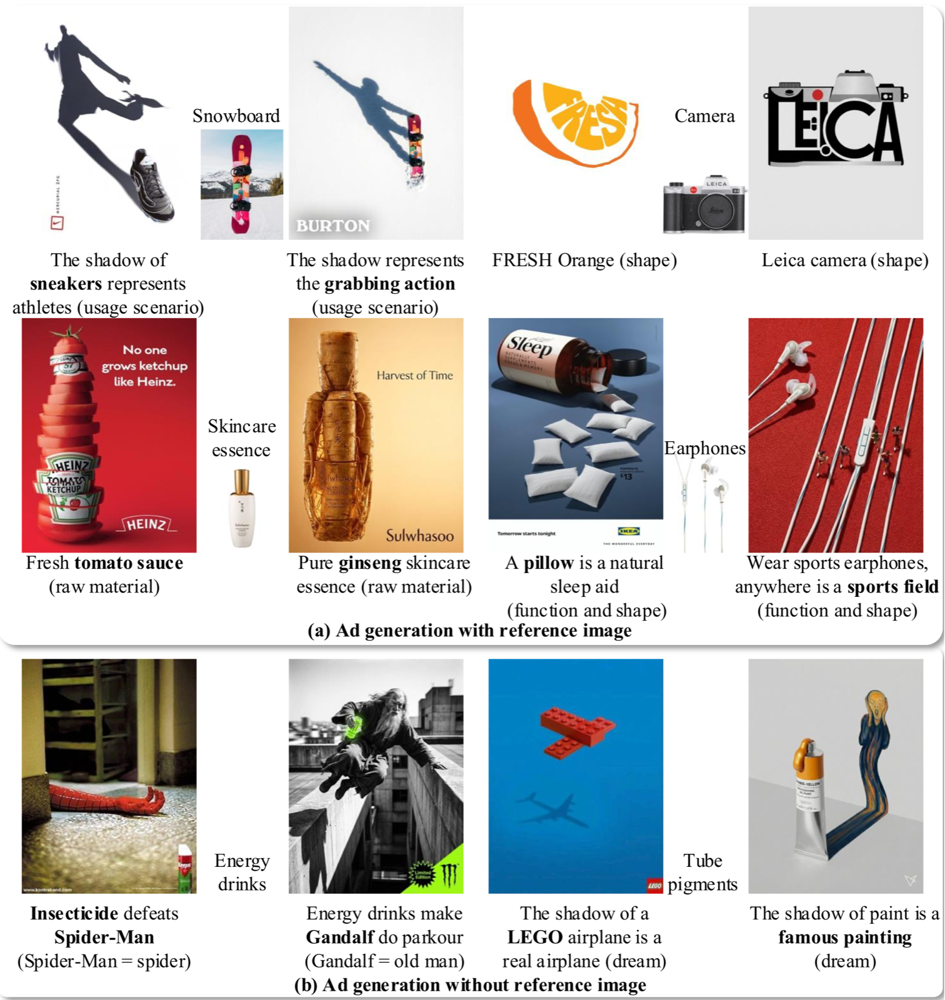
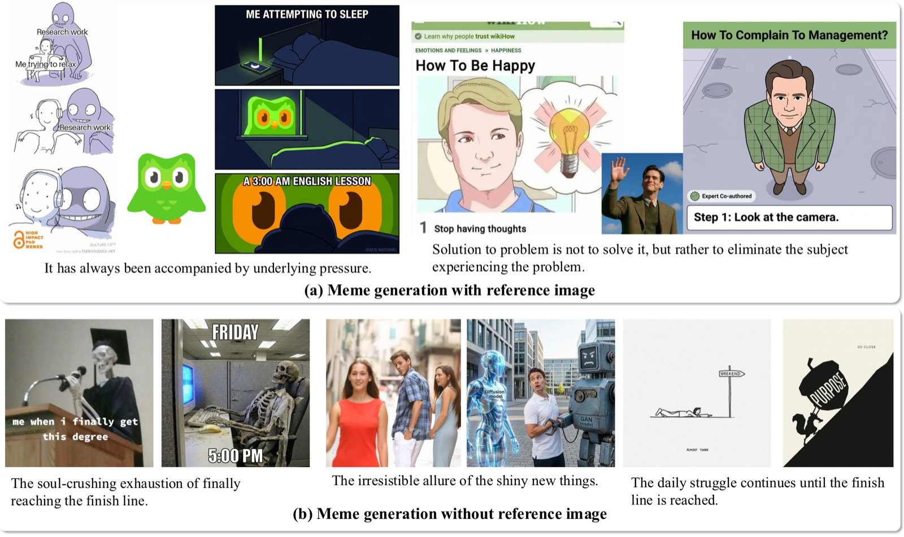
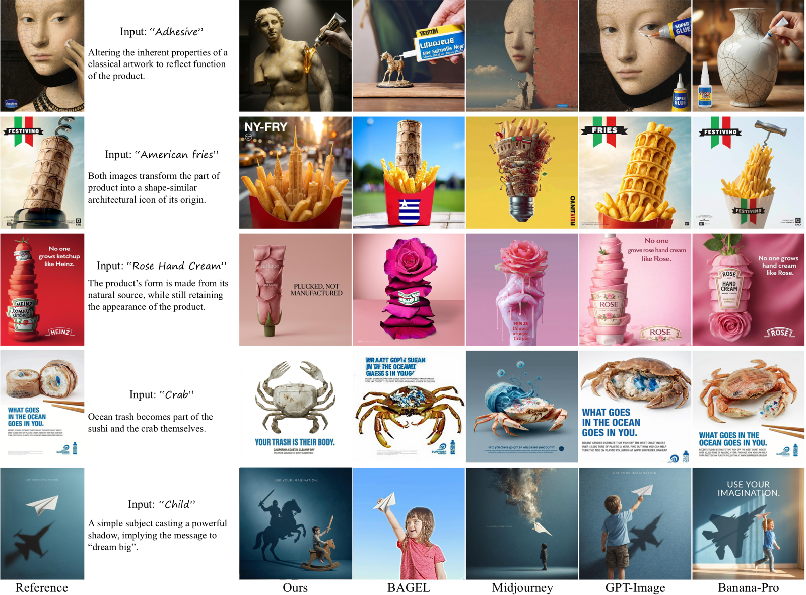

<div align="center">

# Beyond Pixels: Visual Metaphor Transfer via Schema-Driven Agentic Reasoning

### SIGGRAPH Asia 2026

[Yu Xu](https://imxuyu.github.io/)<sup>1</sup>, Yuxin Zhang<sup>1</sup>, Lin Gao<sup>1</sup>, Oliver Deussen<sup>2</sup>, Tong-Yee Lee<sup>3</sup>, Fan Tang<sup>4&#9993;</sup>

<sup>1</sup>University of Chinese Academy of Sciences &nbsp; <sup>2</sup>University of Konstanz &nbsp; <sup>3</sup>National Cheng Kung University &nbsp; <sup>4</sup>University of Science and Technology Beijing

[](https://arxiv.org/abs/2602.01335)
[](LICENSE)

</div>



**Visual Metaphor Transfer (VMT)**: given a reference image that carries a visual metaphor and a user-specified target subject, the model must autonomously decouple the *creative essence* of the reference and re-materialize that abstract logic onto the new subject — going beyond pixel-level instruction alignment and surface-level appearance preservation.

## News

- **2026-08**: The method is packaged as a ready-to-use agent skill — see [`visual-metaphor-transfer/`](visual-metaphor-transfer/).
- **2026-08**: Agent system prompts released.
- **2026-08**: *Beyond Pixels* is accepted to SIGGRAPH Asia 2026. 🎉

## Abstract

A visual metaphor constitutes a high-order form of human creativity, employing cross-domain semantic fusion to transform abstract concepts into impactful visual rhetoric. Despite the remarkable progress of generative AI, existing models remain largely confined to pixel-level instruction alignment and surface-level appearance preservation, failing to capture the underlying abstract logic necessary for genuine metaphorical generation. To bridge this gap, we introduce the task of **Visual Metaphor Transfer (VMT)**, which challenges models to autonomously decouple the "creative essence" from a reference image and re-materialize that abstract logic onto a user-specified target subject. We propose a cognitive-inspired, multi-agent framework that operationalizes **Conceptual Blending Theory (CBT)** through a novel **Schema Grammar (SG)**. This structured representation decouples relational invariants from specific visual entities, providing a rigorous foundation for cross-domain logic re-instantiation. Our pipeline executes VMT through a collaborative system of specialized agents: a perception agent that distills the reference into a schema, a transfer agent that maintains generic space invariance to discover apt carriers, a generation agent for high-fidelity synthesis, and a hierarchical diagnostic agent that mimics a professional critic, performing closed-loop backtracking to identify and rectify errors across abstract logic, component selection, and prompt encoding. Extensive experiments and human evaluations demonstrate that our method significantly outperforms state-of-the-art baselines in metaphor consistency, analogy appropriateness, and visual creativity.

## Framework



A visual metaphor is represented as a 7-tuple **Schema Grammar** `SG = {S, C, A_S, A_es, G, V, I}` (subject, carrier, subject attributes, expressive attributes, generic space, violation points, emergent meaning), a direct operationalization of Conceptual Blending Theory. The pipeline runs four agents in a closed loop — all reasoning agents are driven by **GPT**, and images are synthesized with **GPT-Image**:

1. **Perception Agent** — distills the reference image into `SG_ref`, separating surface entities from abstract relational logic.
2. **Transfer Agent** — synthesizes `SG_tgt` for the target subject while keeping the Generic Space `G` invariant: it profiles the new subject, discovers an apt carrier, and redesigns the violation.
3. **Generation Agent** — translates `SG_tgt` into a stylistically rigorous T2I master prompt, then synthesizes the image with GPT-Image.
4. **Diagnostic Agent** — checks subject salience, violation realization, relational coherence, and meaning alignment, then triggers **hierarchical backtracking**: *prompt-level* (refine the T2I prompt), *component-level* (re-select carrier / redesign violation), or *abstraction-level* (re-extract the reference schema). The loop stops on success or after `tau` iterations (paper: `tau = 5`).

## Examples

Results from the paper — for each pair, the left image is the *reference* and the right is the *generated result*:



**Commercial ad generation** — product attributes are mapped onto novel creative carriers, with or without a reference image:



**Meme generation** — the underlying satirical logic of canonical meme templates transfers to new target entities:



<details>
<summary><b>Comparison with baselines</b> (BAGEL, Midjourney, GPT-Image, Banana-Pro)</summary>



</details>

## Prompts

The four agent system prompts are released verbatim under [`prompts/`](prompts/):

| File | Agent | Paper notation |
| --- | --- | --- |
| [`prompts/perception_agent.md`](prompts/perception_agent.md) | Perception Agent | `p_extract` |
| [`prompts/transfer_agent.md`](prompts/transfer_agent.md) | Transfer Agent | `p_transfer` |
| [`prompts/generation_agent.md`](prompts/generation_agent.md) | Generation Agent | `p_generation` |
| [`prompts/diagnostic_agent.md`](prompts/diagnostic_agent.md) | Diagnostic Agent | `p_critic` |

## Use as an Agent Skill

The method also ships as a self-contained agent skill under [`visual-metaphor-transfer/`](visual-metaphor-transfer/) — the same four prompts orchestrated by a closed-loop workflow ([SKILL.md](visual-metaphor-transfer/SKILL.md)) that any skill-capable coding agent can execute directly. Copy that folder into your agent's skills directory:

| Agent | Skills directory |
| --- | --- |
| Codex | `~/.codex/skills/` |
| Claude Code | `~/.claude/skills/` |
| Cursor | `~/.cursor/skills/` |

Then upload a reference image and ask, for example:

> Use `visual-metaphor-transfer` to transfer this image's metaphor to "FRESH Rose Cream".

The agent needs vision and a text-to-image tool (e.g. GPT-Image). Without an image tool it will stop after Phase 3 and hand you the final master prompt instead.

## Ethics & Responsible Use

The Diagnostic Agent includes a safety and alignment check that rejects or revises
schemas inducing malicious, offensive, or harmful subject-carrier-violation
alignments. Generated metaphors are intended for creative applications such as
advertising and media; please comply with the usage policies of the underlying
model providers.

## Citation

If you find this work useful, please cite:

```bibtex
@inproceedings{xu2026beyondpixels,
  title     = {Beyond Pixels: Visual Metaphor Transfer via Schema-Driven Agentic Reasoning},
  author    = {Xu, Yu and Zhang, Yuxin and Gao, Lin and Deussen, Oliver and Lee, Tong-Yee and Tang, Fan},
  booktitle = {SIGGRAPH Asia 2026 Conference Papers},
  year      = {2026}
}
```
